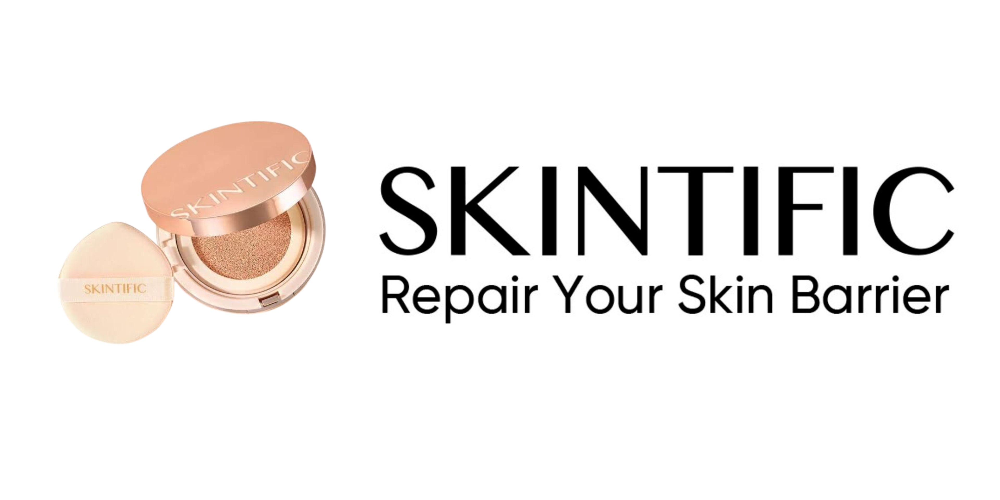

<p align="center">
  
</p>


<div align="center">
## :blue_book: **Deskripsi**
<p align="justify">

Dalam era digital saat ini, ulasan produk dari konsumen memainkan peran yang sangat penting dalam mempengaruhi keputusan pembelian. Salah satu produk yang mendapatkan perhatian luas di pasar kecantikan adalah cushion dari brand Skintific. Cushion, sebagai produk kosmetik yang menggabungkan foundation dan bedak dalam satu kemasan praktis, telah menjadi pilihan populer di kalangan pengguna karena kemudahan penggunaannya dan hasil akhir yang natural. Skintific, dengan reputasinya dalam menghasilkan produk kecantikan berkualitas tinggi, menarik minat banyak konsumen yang ingin mencoba dan membagikan pengalaman mereka melalui ulasan di berbagai platform e-commerce dan media sosial.

</p>

<p align="justify">
Untuk mendapatkan gambaran yang komprehensif mengenai persepsi konsumen terhadap cushion Skintific, diperlukan pengumpulan data ulasan secara menyeluruh. Web scraping adalah teknik untuk mengekstraksi informasi dari suatu situs web. Dalam project ini, web scraping akan dilakukan dari berbagai platform e-commerce dan media sosial yang menyediakan ulasan produk cushion Skintific. Beberapa elemen data yang akan di-scrape mencakup nama pengguna, ulasan, tempat pembelian, jenis shade, dan lama pemakaian. Dengan menggunakan teknik ini, kita dapat mengumpulkan ribuan ulasan konsumen dari berbagai sumber dalam waktu singkat, yang memungkinkan analisis lebih mendalam dan menyeluruh. Tanpa web scraping, mengumpulkan data secara manual akan sangat memakan waktu dan tidak efisien.

</p>

<p align="justify">
  
Dalam project ini, scraping akan dilakukan menggunakan RStudio dengan packages rvest untuk mengambil data yang relevan. Data hasil scraping kemudian akan disimpan ke MongoDB menggunakan package mongolite. Dengan menggunakan database MongoDB, kita dapat mengelola dan mengakses data dalam skala besar dengan efisien.

## :clipboard: **Dokumen**

Berikut contoh dokumen pada Mongo DB :

```
{"_id":{"$oid":"665de1d3f355314913032bd1"},
"user":"annisafauu",
"review":"Cushionnya cocok di aku, high covered banget gak oksodasi juga. Bisa nutupin noda hitam bekas jerawat plus buat aku yg tipe kulit oily ini cocok sih gak ngcrack bikin efek dewi juga pas udah finishingnya. Kalo aku biasanya pake ini kalo lagi gk pake foundi karena kalo double kaya jadi tebel banget. Aku jg pakein lagi bedak tabur pas akhirnya",
"usage_period":"More than 1 year",
"purchase_place":"Shopee",
"shade_cushion":"Cushion 05 Sand"}
```

## :woman_with_headscarf: **Pengembang**
**Erdanisa Aghnia Ilmani (G1501231032)**
